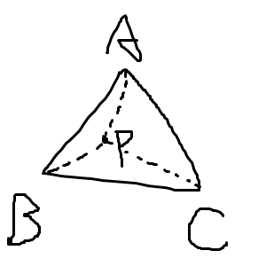
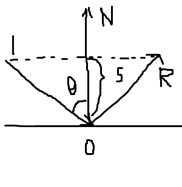

# 前言

面试的问题每个人都不相同，这里我只记录作者本人被问到过的相关图形学问题。在实际的面试过程中，各位需要结合自己的简历将简历中的各项技能以及各个项目加强复习，面试官主要还是以简历为主，除开基础的通用知识以外并不太会刻意刁难你（简历中没有出现的知识点）。

## 图形学

### Q：如何判断一个点是否在三角形内？

将P点分别于三个顶点连接，利用叉乘的性质分别将$\vec{AB}$与$\vec{AP}$、$\vec{BC}$与$\vec{BP}$、$\vec{CA}$与$\vec{CP}$叉乘，如果三者结果符号相同则在三角形。

### Q：PBR基础理论。

[理论 - LearnOpenGL CN (learnopengl-cn.github.io)](https://learnopengl-cn.github.io/07 PBR/01 Theory/#_1)

[光照 - LearnOpenGL CN (learnopengl-cn.github.io)](https://learnopengl-cn.github.io/07 PBR/02 Lighting/)

### Q: 描述一下Blinn-Phong和Phong光照模型。

**Blinn-Phong**：

该模型能够简单地描述物体表面对光的吸收和反射，使物体表面呈现出不同的明暗程度，但其不是最真实的一种反射光模型。

**引入该模型的原因：**它能够用尽量简单的数学原理尽可能解释物体表面呈现出不同颜色及明暗程序的原因。

**现实世界中的三种光照：**

- 「高光」：物体完全反射光源照射到表面的光照到人眼
- 「漫反射光」：物体朝着任意方向反射相同亮度的光照到人眼
- 「环境光」：物体表面完全背对光源，但其它物体反射光照照射到该物体表面上，再通过该物体反射光照到人眼

Bling-Phong 模型可以近似地模拟漫反射光照，但不完全准确。

**漫反射光**

漫反射光是物体表面向四面八方反射相同强度的能量，所以：无论从哪个视角看同一个点，都应该呈现出相同的颜色。

每一个着色点能接受的光能量：
$$
cos\theta=l\dot \quad n
$$
能量衰减：
$$
l^24\Pi I=r^24\Pi I^\prime =>I^2=\frac{I}{r^2}
$$
摄像机接收: 
$$
L_d=k_d(I/r^2) max(0, n\dot \quad l)
$$
$k_d$值为物体表面的漫反射系数，值越大能够反射的光能量越大（吸收的能量越多）。

**高光**

过计算反射光线向量$R$和视角$V$的接近程度来确定看到的高光强度，但是：在计算机中计算反射向量R的计算量非常大。所以，Blinn-Phong光照模型提出使用另一种计算方法：**半程向量**。

半程向量计算方式：
$$
h=v_0 + r_0
$$
比对法向量$n$和半程向量$h$的接近程度，用角度$α$表示：
$$
cosa=\frac{n\dot\quad h}{|n||h|} = n \dot \quad h
$$
由于$cosα∈[0,1]$可以表示物体表面该点反射的高光强度，所以我们可以得到计算高光的公式：
$$
L_s=K_s(\frac{I}{r^2})max(0,cosa)^p=K_s(\frac{I}{r^2})max(0, n\dot \quad h)^p
$$
依旧表示物体表面该点对光的吸收率，在计算机中用RGB值表示。

**环境光**

在 Blinn-Phong 模型中，举出了一个非常大胆的假设：物体表面接收到的各种环境光都是相同强度的。环境光与光源的角度无关，与观察角度也无关，所以它是一个常数。
$$
L_a=K_aI_a
$$
**两者区别：**

Blinn-Phong模型能够更好的表现高光效果，但是相对的计算量也变大了。

### Q：已知入射角和法线，如何计算出反射向量？

$$
R = 2P - I \\
P = I + S \\
S = \frac{-I \dot \quad N}{|N|^2} \dot \quad N\\
\text{因为N为单位向量: }S=-I\dot \quad N^2\\
R = 2I + 2S - I = I + 2S = I - 2I\dot \quad N^2
$$

### Q：PBD是什么？

基于物理的模拟PBD（Position Based Dynamics）算法是一种用于模拟物体的物理行为和运动的算法。其核心思想是离散化物体的运动方程，将其分解为一系列迭代步骤，每一步都用来更新物体的位置和速度。这些迭代步骤可以模拟多种物理现象，包括弹性、碰撞、液体流动等。

### Q：如何渲染字体？

引擎中支持Bitmap和System Font两种形式的字体，Bitmap实际上是一个位图，某一个区块的像素点能够代表一个有效信息，通过**.fnt**文件读取对应字体的偏移量获取信息；System Font使用**.ttf .ttc**格式的系统字体。

## Vulkan API

### Q：在Vulkan中有哪几种同步机制？

Fence：用于同步渲染队列与CPU之间的同步，有**signaled**和**unsignaled**两种状态。

Semaphore：用于渲染队列每次提交的一批命令之间的同步，与Fence一样有**signaled**和**unsignaled**两种状态。

Fence用于阻塞CPU知道Queue中的命令执行结束（GPU与CPU之间的同步），Semaphore用于不同命令提交之间的同步（GPU与GPU之间的同步）。

### Q：DX中没有Subpass的概念，那么Vulkan中Subpass有什么作用？有哪些特别之处？

subpass可以共享一个Renderpass中的附件，并且不同的subpass之间可以不用存在依赖关系，能够并行进行。

## C/C++基础

### Q：malloc是一次系统调用吗？

不是。实际上malloc只是一个库函数，底层调用mmap()系统调用或brk()系统调用。

#### Q：描述一下virtual作用。

virtual虚函数是C++中实现多态的关键，程序在调用类函数时如果会查找类内虚函数表调用对应函数；构造函数不可使用virtual（原因简而言之就是创建时没有类对象就没有地方存放虚函数表）。

### Q：inline作用以及为什么使用。

**将函数展开，把函数的代码复制到每一个调用处**。 这样调用函数的过程就可以直接执行函数代码，而不发生跳转、压栈等一般性函数操作。 可以节省时间，也会提高程序的执行速度。

### Q：static关键字作用。

**static的第二个作用是保持变量内容的持久。（static变量中的记忆功能和全局生存期）****。如果作为static局部变量在函数内定义，它的生存期为整个源程序，但是其作用域仍与自动变量相同，只能在定义该变量的函数内使用该变量。退出该函数后， 尽管该变量还继续存在，但不能使用它。

**C++中的类成员声明static**

(1)类的静态成员函数是属于整个类而非类的对象，所以它没有this指针，这就导致 了它仅能访问类的静态数据和静态成员函数。    

(2)不能将静态成员函数定义为虚函数。    

(3)由于静态成员声明于类中，操作于其外，所以对其取地址操作，就多少有些特殊 ，变量地址是指向其数据类型的指针 ，函数地址类型是一个“nonmember函数指针”。

(4)由于静态成员函数没有this指针，所以就差不多等同于nonmember函数，结果就 产生了一个意想不到的好处：成为一个callback函数，使得我们得以将C++和C-based X W indow系统结合，同时也成功的应用于线程函数身上。 （这条没遇见过） 

(5)static并没有增加程序的时空开销，相反她还缩短了子类对父类静态成员的访问 时间，节省了子类的内存空间。    

(6)静态数据成员在<定义或说明>时前面加关键字static。    

(7)静态数据成员是静态存储的，所以必须对它进行初始化。 （程序员手动初始化，否则编译时一般不会报错，但是在Link时会报错误）   

(8)静态成员初始化与一般数据成员初始化不同:

**额外问题**：c文件中变量加static与直接定义有什么区别？

有static关键字则只在该文件中生效，否则全局生效。

### Q：声名类变量和创建类变量的区别。

还没找到，我能想到的只有创建出来的对象一个是实例一个是指针。

### Q：shared_ptr和weak_ptr的原理与作用？

shared_ptr和weak_ptr均可用于动态资源管理。

shared_ptr基于“引用计数”模型，多个shared_ptr指向同一个对象并维护一个共享的引用计数器。当最后一个指向对象的shared_ptr销毁时会自动销毁其所指的对象(delete)。

weak_ptr用于解决“引用计数”模型循环依赖问题，weak_ptr指向一个对象并不增减该对象的引用计数。

